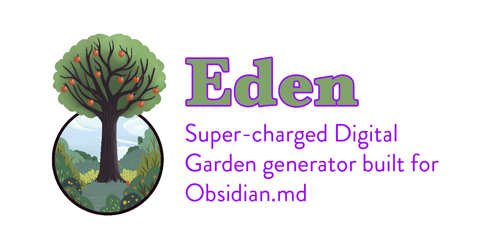

# Eden


**Converts an Obsidian vault into a super-charged digital garden of static html.**

See [CurrentTasks.md](tasks/CurrentTasks.md) for up-to-date development tasks

## Usage
| Usage | Command |
| --- | --- |
|Simplest usage| `deno run https://deno.land/x/eden path/to/my/vault/` |
|Generate and preview the outputted html| `deno run https://deno.land/x/eden --preview path/to/my/vault/ && start http://localhost:8000/`|
|Run with permissions| `deno run --allow-net --allow-write --allow-read --allow-env https://deno.land/x/eden path/to/my/vault/`|

## Features
- [x] Breadcrumbs
- [x] Metadata Support [[Metadata]]
    - Created Date (automatic)
    - Last Edited Date (automatic)
    - hidden (prevents publishing the page)
    - type
    - tags (automatically generates an index page that links to all pages with a given tag)
    - template (allows overriding html template)
    - alias ([Link to a note using a metadata alias](https://help.obsidian.md/Linking+notes+and+files/Aliases#Link+to+a+note+using+an+alias))
- [x] Future-proof: Exportable data, portable, control and own your data, no lock-in
- [x] Highly Customizable HTML and CSS [[plain]]
    - [x] Javascript is supported and is fully optional!
- [x] Backlinks [[backlinks]]
- [x] Website icons next to external links (Like this: [Youtube](https://youtube.com))
- [x] ️Built-in rss feed support (automatically creates `/rss.xml`)
- [x] Support for Footnotes ^[example footnote]
- [x] [Support sizing images](https://help.obsidian.md/Editing+and+formatting/Basic+formatting+syntax#External+images)
- [x] Navigation: Support for vertical and horizontal nav depending on screen size.  Collapsable sections
- [x] Support embeddable images [[images]]
- [x] Block Embedding [[embedding]]
    - Block-based, content as data, so the same piece of content can easily be transcluded in multiple places
        - Adding in dynamically updated bits of content into other bits of content
        - https://subpixel.space/entries/open-transclude/
        - [Obsidian named block ids](https://help.obsidian.md/Linking+notes+and+files/Internal+links#Link+to+a+block+in+a+note)
- [x] Embeddable content
    - [x] Embeddable Youtube Videos
    - [x] Embeddable Vimeo Videos
    - [x] Embeddable Tweets
- [ ] Faster Execution with caching
    - Skips files if the .md is older than the .html and the template / css
- [ ] Site search
    - [x] make entire garden available in json at /garden.json for advanced usage 
- [ ] 🔑Backlinks should include optional context snippets
- [ ] Metadata `thumbnail` for article for when it's displayed in an index page
- [ ] [Obsidian CSS Snippets](https://help.obsidian.md/Extending+Obsidian/CSS+snippets)
- [ ] Ability to create different object types, ontologies, and tags
    - Example: https://www.gwern.net/About#confidence-tags
    - Example: Maggie Appleton's site, which has "Notes", "Essays", and "Patterns", among other collections of different objects
- [ ] Expandible/collapsible blocks
- [ ] [Embed Audio files](https://help.obsidian.md/Linking+notes+and+files/Embedding+files#Embed+an+audio+file+in+a+note)
- [ ] [Embed pdf](https://help.obsidian.md/Linking+notes+and+files/Embedding+files#Embed+a+PDF+in+a+note)
- [ ] [Embed search results](https://help.obsidian.md/Linking+notes+and+files/Embedding+files#Embed+search+results)
- [ ] Support syntax highlighting
- [ ] ❓Print-ready, capable of being exported to EPUB or PDF
- [ ] Customizable header (like https://maggieappleton.com/) that works with transclusion.
- [ ] Template Footer
    - [x] link to rss.xml
    - [ ] social links
    - [ ] copyright

### Obsidian Flavored Markdown Support
| Completed | Syntax | Feature Name | Note |
| --------- | ------- | ------------ | --- |
| ✅ |`[[Link]]` | Internal links | |
| ✅ |`!​[[Link]]` | Embedding files | |
| ✅ |`![[image.png]]` | Embedding image | |
| ✅ |`![[Link#^id]]` | Block references | |
| ✅ |`^id` | Defining a block | |
| ✅ |`%%Text%%` | Comments | |
| ✅ |`~~Text~~` | Strikethroughs | |
| ✅ |`==Text==` | Highlights | |
| ⏳ |` ``` ` | Code blocks | Todo: Syntax highlighting [lib](https://www.npmjs.com/package/markdown-it-highlightjs) |
| ✅ |`- [ ]` | Incomplete task | |
| ✅ |`- [x]` | Completed task | |
| ⏳ |`> [!note]` | Callouts | Todo: styling |
| ✅ |`[[page\|modified title]]` | Modified title | [source](https://publish.obsidian.md/hub/04+-+Guides%2C+Workflows%2C+%26+Courses/Guides/Markdown+Syntax#Obsidian's+Custom+markdown+syntax) |
| ✅ |`[[page#header1]]` | Link to header | [source](https://publish.obsidian.md/hub/04+-+Guides%2C+Workflows%2C+%26+Courses/Guides/Markdown+Syntax#Obsidian's+Custom+markdown+syntax)|
| ✅ |`[[page#^blockId]]` | Link to blockId | [source](https://publish.obsidian.md/hub/04+-+Guides%2C+Workflows%2C+%26+Courses/Guides/Markdown+Syntax#Obsidian's+Custom+markdown+syntax)|


### Easy hosting with Static.app
https://static.app/ is the simplest hosting solution for non-technical users.  Simply drag-n-drop your static html files found at `eden-md-out/YOUR_PROJECT_NAME` and your website is live!

### Complex hosting with Git and Vercel
To use Eden with Vercel and Git for Continuous Deployment, set the followin Project Settings in Vercel:

Build Command: `/vercel/.deno/bin/deno run --allow-net --allow-write --allow-read --allow-env https://deno.land/x/eden --parseDir .`

Output Directory: `eden-md-out/YOUR_PROJECT_NAME` (note: YOUR_PROJECT_NAME is found in eden-md-config in your markdown vault directory)

Install Command: `curl -fsSL https://deno.land/x/install/install.sh | sh`

## Support this Project
I've created Eden on my own time and out of my own pocket.  If you benefit from it please consider donating!

https://github.com/sponsors/jdoleary